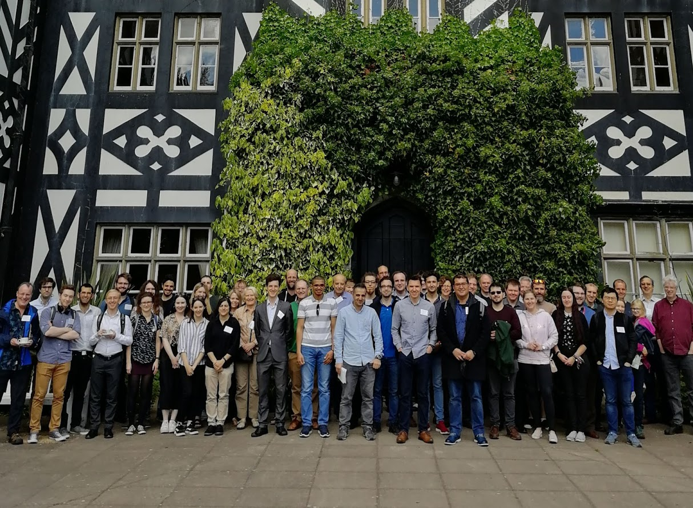

#### The 2019 meeting was held at Gregynog Hall, Newtown on 20-22 May 2019. 

#### Thank you to all participants!

<table width="100%" border="1">
  <tr>
    <td align="center"><a href = "Gregynog2019Timetable.pdf">Programme</a> </td><td align="center"> <a href = "Gregynog2019Abstracts.pdf">Abstracts</a> </td></tr></table>

A special thank you to our plenary speakers:
- [Professor Reidun Twarock](https://www.york.ac.uk/maths/staff/reidun-twarock/), University of York, UK: Mathematical Biology and Mathematical Physics
- [Professor Helen Byrne](https://www.maths.ox.ac.uk/people/helen.byrne), University of Oxford, UK: Mathematical and Computational Models in Biomedical Systems
- [Professor Stephen Gourley](https://www.surrey.ac.uk/people/stephen-gourley), University of Surrey, UK: Theory and Applications of Delay Differential Equations

The main organiser of the Colloquium was [Kristian Evans](https://www.swansea.ac.uk/staff/science/maths/k.evans/) (Swansea University, Department of Mathematics). The Colloquium was supported by an London Mathematical Society (LMS) conference grant.
