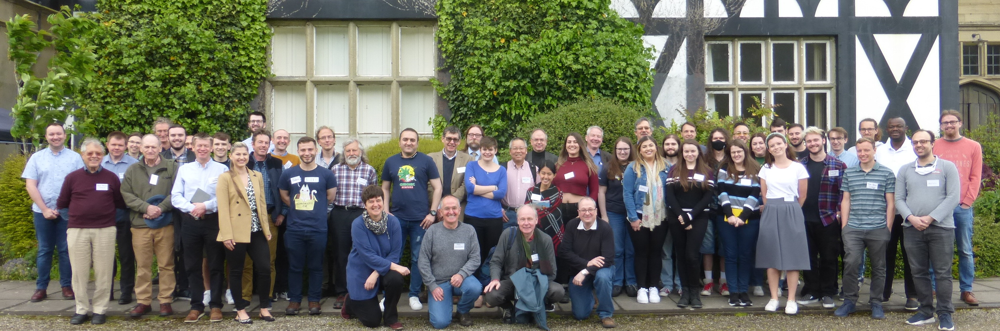

**Wales Mathematics Colloquium, Gregynog Hall, Newtown, 23-25 May 2022**

The invited speakers in 2022 were:

  Professor **Chris Breward**, University of Oxford 
  Professor **Philip Jonathan**, Lancaster University 
  Professor **Brita Nucinkis**, Royal Holloway, University of London 
  Professor **Stefan Weigert**, University of York 

The schedule of all talks is available <a href = "../timetable250522-Gregynog22.pdf">here</a>.

The main organiser of the Colloquium was **Rolf Gohm** (Aberystwyth University, Department of Mathematics). 

The meeting was supported by an LMS Scheme 1 Grant.
  
 Here is a photo of (most of) the participants: 
  
