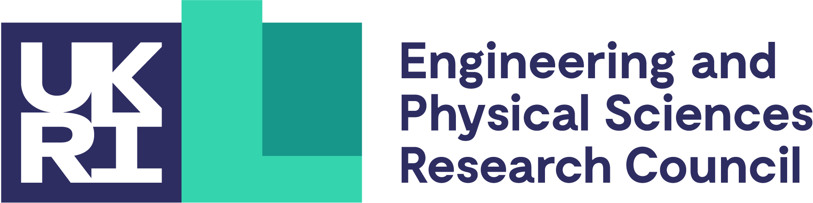

#### **Wales Mathematics Colloquium, Gregynog Hall, Newtown, 18-20 May 2026**

<!--img style="float: center;" src="../media/gregynog_group_photo25.jpg" width="800pt" alt="photo of 2026 participants outside gregynog hall"-->

At the 2026 event, the following speakers gave keynote lectures: 

[Professor Victoria Gould (York)](https://www.york.ac.uk/maths/people/victoria-gould/): algebraic semigroup theory  

[Dr Madalin Guta (Nottingham)](https://www.nottingham.ac.uk/mathematics/people/madalin.guta): quantum statistics and information geometry  

[Professor John Willis FRS (Cambridge)](https://www.maths.cam.ac.uk/person/jrw1005): theoretical solid mechanics  

Further talks were also given by staff and students. The timetable is available here: [Timetable](../media/Gregynog2026_timetable.pdf)

The organisers of the 2026 Colloquium were [Gwion Evans](https://www.aber.ac.uk/en/maths/staff-profiles/listing/profile/dfe/) and [Rolf Gohm](https://www.aber.ac.uk/en/maths/staff-profiles/listing/profile/rog/) from Aberystwyth University.

The Colloquium was supported by the Heilbronn Institute for Mathematical Research (HIMR), through the UKRI/EPSRC
Additional Funding Programme for Mathematical Sciences, and the QJMAM Fund for Applied Mathematics, administered by the IMA.

