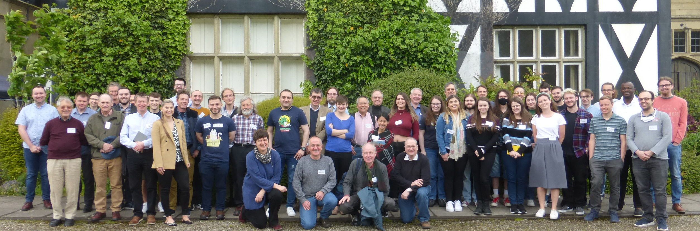

#### Wales Mathematics Colloquium, Gregynog Hall, Newtown, 22-24 May 2023. 

This is a long-standing annual event with a broad mathematical outlook across areas of pure and applied mathematics, statistics and OR. It is aimed at bringing together mathematicians at Welsh HEIs, while also welcoming mathematicians from other parts of the UK.

It plays an important role in fostering mathematical discussion and collaboration between staff and postgraduates in Wales, both on research topics and on higher education policy, and offers a stimulating environment for postgraduate researchers to present their results with ample time for follow-up discussion.

<!--The following invited speakers have agreed to give keynote lectures:
- [Professor Chris Breward](https://people.maths.ox.ac.uk/breward/), University of Oxford. 
     *Titles: Industrial Mathematics: What is it good for? *
             *Removing SO_2 from gas: the mathematics of reactive filtration*

- [Professor Philip Jonathan]( http://www.lancs.ac.uk/~jonathan/), Lancaster University. 
      *Titles: Gwrthdroi tebygoliaethol: synhwyro o bell i nodweddu ffynonnellau nwyon atmosfferig *
               *Non-stationarity in extreme value models*
     
- [Professor Brita Nucinkis](https://pure.royalholloway.ac.uk/portal/en/persons/brita-nucinkis(1256195e-d48e-4e83-bc02-c50d77ab01a9).html), Royal Holloway, University of London. 
      *Titles: An introduction to Thompson’s groups and their generalisations. *
              *On automorphism groups of Cantor Algebras*
      
- [Professor Stefan Weigert](https://www.york.ac.uk/maths/staff/stefan-weigert/), University of York. 
      *Title: A survey of mutually unbiased bases.*--->

Talks will be solicited from those attending.

The main organisers of the 2023 Colloquium are [Matthew Lettington](https://www.cardiff.ac.uk/people/view/140706-lettington-matthew) and [Karl Michael Schmidt](https://www.cardiff.ac.uk/people/view/98668-schmidt-karl) (Cardiff University, School of Mathematics).

